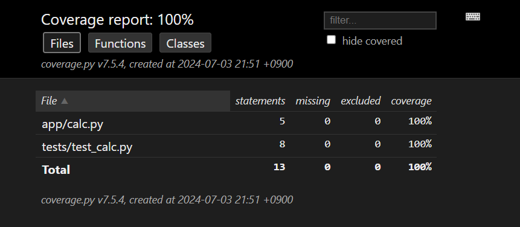
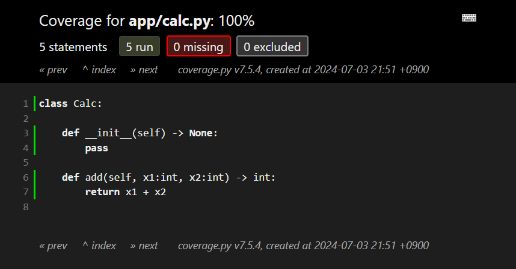
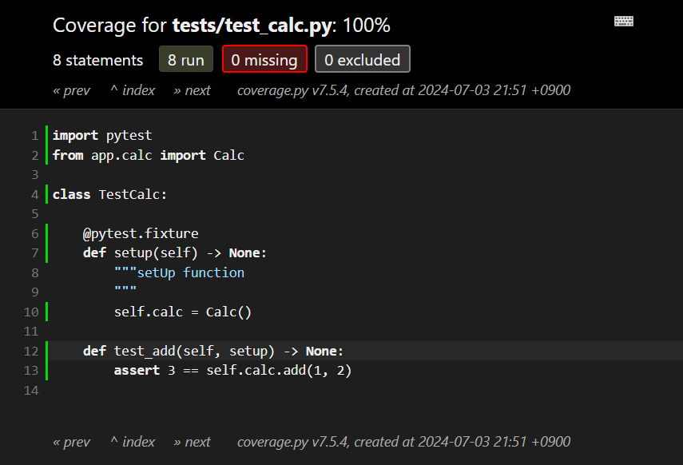

Pytest Skeleton
===

## テストファイルの準備

- ファイル構成

    ```text
    |-- app
    | |-- calc.py
    |-- requirements.txt
    |-- tests
    | |-- test_calc.py
    ```

- app/calc.py

    ```python
    class Calc:

        def __init__(self) -> None:
            pass

        def add(self, x1:int, x2:int) -> int:
            pass
    ```

- tests/test_calc.py

    ```python
    import pytest
    from app.calc import Calc

    class TestCalc:

        @pytest.fixture
        def setup(self) -> None:
            """setUp function
            """
            self.calc = Calc()

        def test_add(self, setup) -> None:
            assert 3 == self.calc.add(1, 2)
    ```

- requirements.txt

    ```text
    pytest
    pytest-cov
    ```

## テストの実行

- 実行環境の準備

    ```bash
    python3 -m venv venv
    source ./venv/bin/activate
    pip install -r requirements.txt
    ```

- テストの実行

    ```bash
    PYTHONPATH=./ pytest
    ```

    この時点では実装コードがないので、テスト結果は必ず Failed になります。

## コード修正

```diff
--- /tmp/calc.py        2024-07-03 21:33:12.492776870 +0900
+++ app/calc.py 2024-07-03 21:33:26.965119735 +0900
@@ -4,5 +4,5 @@
         pass

     def add(self, x1:int, x2:int) -> int:
-        pass
+        return x1 + x2
```

再度テストを実行すると OK となるはずです。

## テスト結果の確認

- カバレッジの確認 (CLI)

    ```bash
    PYTHONPATH=./ pytest -v --cov=./ --cov-report=term-missing
    ```

    ```text
    ================================================= test session starts ==================================================
    platform linux -- Python 3.12.3, pytest-8.2.2, pluggy-1.5.0 -- /home/xubuntu/work/project/venv/bin/python3
    cachedir: .pytest_cache
    rootdir: /home/xubuntu/work/project
    plugins: cov-5.0.0
    collected 1 item

    tests/test_calc.py::TestCalc::test_add PASSED                                                                    [100%]

    ---------- coverage: platform linux, python 3.12.3-final-0 -----------
    Name                 Stmts   Miss  Cover   Missing
    --------------------------------------------------
    app/calc.py              5      0   100%
    tests/test_calc.py       8      0   100%
    --------------------------------------------------
    TOTAL                   13      0   100%


    ================================================== 1 passed in 0.04s ===================================================
    ```

- カバレッジの確認 (GUI)

    ```bash
    PYTHONPATH=./ pytest -v --cov=./ --cov-report=html
    ```

    カレントディレクトリに htmlcov が生成されます。
    htmlcov/index.html から結果を参照できます。HTML 出力は CLI の出力より優秀で、カバレッジ率に加え、どのコードが実行されていて、どのコードが実行されていないかを視覚的に確認できます。  
    出力内容は coverage から実行した unittest と同じになります。

    - 実行例 (カバレッジ)

        カバレッジはファイル単位、関数単位、クラス単位の 3 パターンで集計されています。

        

    - 実行例 (テスト対象ファイルの確認)

        緑の行数がテストで実行されたコードになります。  
        一応、実装されたコードすべてがテストされていることを確認できます。

        

    - 実行例 (テストファイルの確認)

        テストコード本体以外で未実行のコードがあることを確認できます。

        