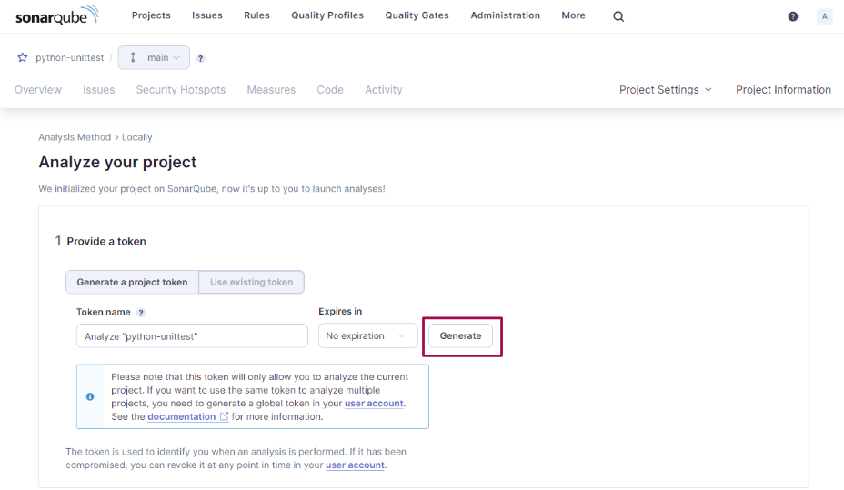

[SonarQube](https://www.sonarsource.com/products/sonarqube/)
===

## SonarQube の導入

- Linux Kernel パラメータの設定

    /etc/sysctl.conf に下記の内容を追加するか、下記の内容で /etc/sysctl.d/99-sonarqube.conf を作成します。  
    SonarQube 内で使用する Elasticsearch に関連しているらしい。

    - /etc/sysctl.conf に追記する内容

        ```text
        fs.file-max=65536
        vm.max_map_count=262144
        ```

    - /etc/sysctl.d/99-sonarqube.conf を作成する場合

        ```bash
        sudo bash -c 'echo -e "fs.file-max=65536\nvm.max_map_count=262144" \
            > /etc/sysctl.d/99-sonarqube.conf'
        sudo reboot
        ```

- docker-compose.yml

    ```yaml
    version: "3"
    services:

        ### SonarQube
        sonarqube:
            image: sonarqube
            container_name: sonarqube
            hostname: sonarqube
            restart: always
            ports:
                - 9000:9000
            environment:
                - SONARQUBE_JDBC_USERNAME=sonar
                - SONARQUBE_JDBC_PASSWORD=sonar
                - SONARQUBE_JDBC_URL=jdbc:postgresql://sonarqube_db:5432/sonar
            #volumes:
            #    - ./volume/sonarqube/conf:/opt/sonarqube/conf
            #    - ./volume/sonarqube/data:/opt/sonarqube/data
            #    - ./volume/sonarqube/extensions:/opt/sonarqube/extensions
            #    - ./volume/sonarqube/logs:/opt/sonarqube/logs
            links:
                - sonarqube_db

        sonarqube_db:
            image: postgres
            container_name: sonarqube_db
            hostname: sonarqube_db
            restart: always
            environment:
                - POSTGRES_USER=sonar
                - POSTGRES_PASSWORD=sonar
            volumes:
                - ./volume/sonarqube/pgdata:/var/lib/postgresql/data
    ```

- docker コンテナの起動

    ```bash
    docker compose up -d --build
    ```

    SonarQube の設定やプラグイン等を永続化したい場合は、動作中の SonarQube コンテナから volumes で指定するディレクトリパスので全ファイルをコンテナ外のディレクトリにコピーし、アクセス権限を調整した上で、volumes の設定を有効にすると永続化できます。  
    インターネット上の解説サイトを見ていると、面倒な操作は行っていないようですので、他に方法があるかもしれないです。

    お試し稼働であれば、データの永続化は不要なので、上記の設定で起動します。

- ログイン確認

    ブラウザで `http://sonarqubeのIPアドレス:9000/` を参照するとログイン画面が表示されると思います。  
    デフォルトの管理者ログイン ID / パスワードは下記の通りです。

    | 項目     | 値    |
    | :------- | ----- |
    | Login ID | admin |
    | Password | admin |

    初回ログイン時にパスワードの変更を強制されます。

## Python プロジェクトの登録

1. `Create a local Project' リンクを押下

    


2. プロジェクト名の入力

    

3. SonarQube の解析対象コードの定義 (だと思う)

    

    説明文の感じだと、すべてを解析対象にするのか、何らかのベースラインからの差分なのかの設定だと思います。

4. コード解析で連携する CI ツールの選択

    

5. アクセストークンの生成

    

    有効期限切れ対応が面倒な場合は `Expires in` を `No expiration` にして置きます。  
    `Generate` ボタンを押下するとアクセストークンが生成されます。

6. プロジェクトの主に言語選択

    

    Maven と Gradle は言語ではない気がしますが、言語？を選択すると、言語 x OS 用の sonarscanner コマンドの実行方法が表示されます。

    

    [Unittest](../unittest/01_skeleton.md) や [Pytest](../pytest/01_skeleton.md) のカバレッジの確認で、XML 形式の出力結果を使用します。

## [Sonar Scanner](https://docs.sonarsource.com/sonarqube/10.6/analyzing-source-code/scanners/sonarscanner/) のインストール

- インストール

    ```bash
    wget https://binaries.sonarsource.com/Distribution/sonar-scanner-cli/sonar-scanner-cli-6.1.0.4477-linux-x64.zip \
        -O /tmp/sonar-scanner-cli-6.1.0.4477-linux-x64.zip
    sudo unzip /tmp/sonar-scanner-cli-6.1.0.4477-linux-x64.zip -d /usr/local/
    ```

- 実行

    - PATH は事前に通しておいた方が便利です。
    - SonarQube のプロジェクト作成で提示されたオプションをコピーします。

    ```bash
    PATH=/usr/local/sonar-scanner-6.1.0.4477-linux-x64/bin:$PATH sonar-scanner \
        -Dsonar.projectKey=python-unittest \
        -Dsonar.sources=. \
        -Dsonar.host.url=http://localhost:9000 \
        -Dsonar.token=sqp_23e3214a9242d1417e045811833b19e2a526fce5
    ```

    SonarQube のプロジェクト作成時に提示されたコマンドオプションで実行すると、カレントディレクトリ配下の全ディレクトリ、全ソースが解析対象になってしまって、結果を見ても何の解析結果なのか判断できないものが表示されます。  

    このため、

    - 解析対象のソースコードの拡張子
    - 解析対象の言語
    - カバレッジ集計結果の XML ファイル

    をコマンドオプションで指定するようにします。

    ```bash
    PATH=/usr/local/sonar-scanner-6.1.0.4477-linux-x64/bin:$PATH sonar-scanner \
        -Dsonar.projectKey=python-unittest \
        -Dsonar.sources=. \
        -Dsonar.host.url=http://localhost:9000 \
        -Dsonar.token=sqp_23e3214a9242d1417e045811833b19e2a526fce5 \
        -Dsonar.exclusions=**/test_*.py,**/*xml,**/*pyc,**/venv/**,**/cover/** \
        -Dsonar.language=py \
        -Dsonar.python.coverage.reportPaths=coverage.xml
    ```

### sonar-project.properties

sonar-project.properties ファイルにコマンドオプションを書いておくと、オプション無しの sonar-scanner でテスト結果を SonarQube に送信できます。  
コマンドオプションの先頭の `-D` を削除した文字列を sonar-project.properties に書くだけです。

* sonar-project.properties の作成

    ```text
    sonar.projectKey=python-unittest
    sonar.sources=.
    sonar.host.url=http://localhost:9000
    sonar.token=sqp_23e3214a9242d1417e045811833b19e2a526fce5
    sonar.exclusions=**/test_*.py,**/*xml,**/*pyc,**/venv/**,**/cover/**
    sonar.language=py
    sonar.python.coverage.reportPaths=coverage.xml
    ```

* sonar-scanner の実行

    ```bash
    PATH=/usr/local/sonar-scanner-6.1.0.4477-linux-x64/bin:$PATH sonar-scanner -X
    ```
