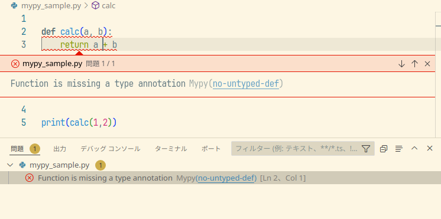
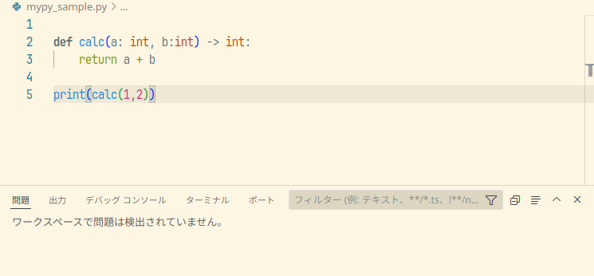

Python 向けの VSCode 設定
===

## [autoDocstring - Python Docstring Generator](https://marketplace.visualstudio.com/items?itemName=njpwerner.autodocstring)

クラスや関数定義の下の行で

- `"""` (ダブルクォーテーション3個)または `'''` (シングルクォーテーション3個)
- `Ctrl + Shift + 2 (Windows,Linux)` / `cmd + shit + 2 (macOS)`

を押下すると docstring のひな型を生成してくれます。  
関数引数や戻り値の型アノテーションを適切に設定しておくと、型アノテーションを考慮した docstring を生成してくれるので、引数や関数戻り値の型説明を書く手間を削減してくれます。


## [Flake8](https://marketplace.visualstudio.com/items?itemName=ms-python.flake8)

Linter の設定方法が変わったらしいです。

```bash
{
  "flake8.args": [
    "--max-line-length=120",
    "--max-complexity=10",
  ],
}
```

## [Mypy Type Checker](https://marketplace.visualstudio.com/items?itemName=ms-python.mypy-type-checker)

mypy をインストールしていると型アノテーション指定無しを問題として検出してくれます。

- VSCode の設定

    ```json
    {
    "mypy-type-checker.args": ["--disallow-untyped-defs"],
    "mypy-type-checker.importStrategy": "fromEnvironment"
    }
    ```

- 使用例

    

    引数と関数戻り値を追加すると問題が解決します。

    
