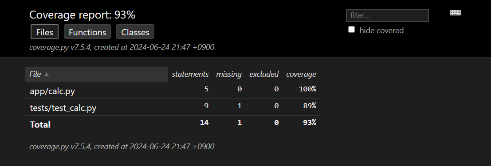
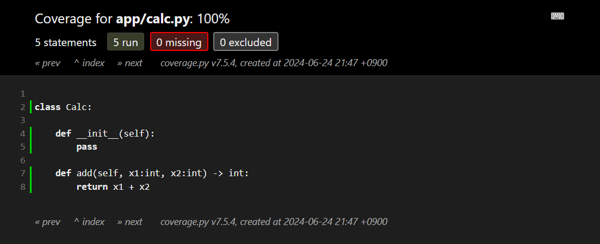
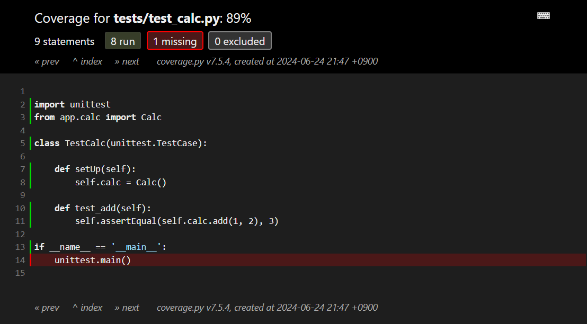

UnitTest Skeleton
===

## テストファイルの準備

- ファイル構成

    ```text
    |-- app
    | |-- calc.py
    |-- requirements.txt
    |-- tests
    | |-- test_calc.py
    ```

- app/calc.py

    ```python
    class Calc:

        def __init__(self) -> None:
            pass

        def add(self, x1:int, x2:int) -> int:
            pass
    ```

- tests/test_calc.py

    ```python
    import unittest
    from app.calc import Calc

    class TestCalc(unittest.TestCase):

        def setUp(self) -> None:
            self.calc = Calc()

        def test_add(self) -> None:
            self.assertEqual(self.calc.add(1, 2), 3)

    if __name__ == '__main__':
        unittest.main()
    ```

- requirements.txt

    ```text
    coverage
    ```

## テストの実行

- 実行環境の準備

    ```bash
    python3 -m venv venv
    source ./venv/bin/activate
    pip install -r requirements.txt
    ```

- テストの実行

    ```bash
    coverage run -m unittest discover tests
    ```

    この時点では実装コードがないので、テスト結果は必ず Failed になります。

## コード修正

```diff
--- /tmp/calc.py        2024-06-24 21:43:12.327949085 +0900
+++ app/calc.py 2024-06-24 21:43:01.383949520 +0900
@@ -5,4 +5,4 @@
         pass

     def add(self, x1:int, x2:int) -> int:
-        pass
+        return x1 + x2
```

再度テストを実行すると OK となるはずです。

## テスト結果の確認

- カバレッジの確認 (CLI)

    ```bash
    coverage report
    ```

    ```text
    Name                 Stmts   Miss  Cover
    ----------------------------------------
    app/calc.py              5      0   100%
    tests/test_calc.py       9      1    89%
    ----------------------------------------
    TOTAL                   14      1    93%
    ```

- カバレッジの確認 (GUI)

    ```bash
    coverage html
    ```

    カレントディレクトリに `htmlcov` が生成されます。  
    htmlcov/index.html から結果を参照できます。HTML 出力は CLI の出力より優秀で、カバレッジ率に加え、どのコードが実行されていて、どのコードが実行されていないかを視覚的に確認できます。

    - 実行例 (カバレッジ)

        カバレッジはファイル単位、関数単位、クラス単位の 3 パターンで集計されています。
        

    - 実行例 (テスト対象ファイルの確認)

        緑の行数がテストで実行されたコードになります。  
        一応、実装されたコードすべてがテストされていることを確認できます。

        

    - 実行例 (テストファイルの確認)

        テストコード本体以外で未実行のコードがあることを確認できます。  
        ただ、この未テストコードは省略できないっぽい。

        
